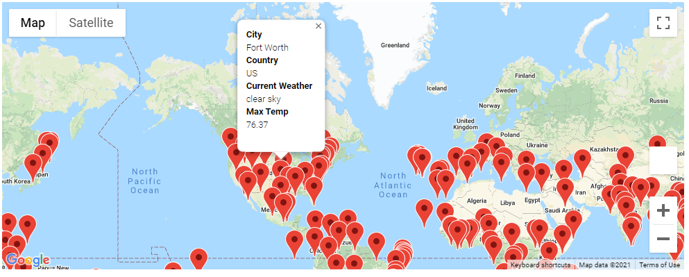
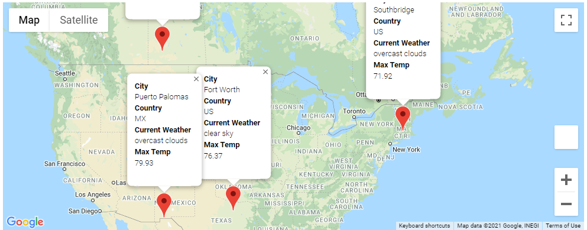
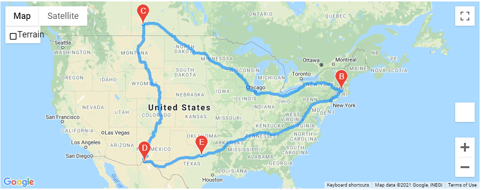

# world_weather_analysis_UT_DATA
a fun new project on world weather analysis

## Project Overview

Jack loves the PlanMyTrip app. Beta testers love it too. And, as with any new product, they’ve recommended a few changes to take the app to the next level. Specifically, they recommend adding the weather description to the weather data you’ve already retrieved in this module. Then, you'll have the beta testers use input statements to filter the data for their weather preferences, which will be used to identify potential travel destinations and nearby hotels. From the list of potential travel destinations, the beta tester will choose four cities to create a travel itinerary. Finally, using the Google Maps Directions API, you will create a travel route between the four cities as well as a marker layer map.

## Resources

- Data Source:
   - [city weather data (csv)](./Weather_Database/weatherPy_database.csv)
   - [city hotel data (csv)](./Vacation_Search/WeatherPy_vacation.csv)
- Software:
   - Python 3.7.6
   - Jupyter Notebook 6.3.0
- APIs
    - Google Maps (google)
    - Google Directions (google)
    - Weather (openweathermap)
   
## Output

    - [Cities Weather (png)](./Vacation_Search/WeatherPy_vacation_map.png)
    

    - [Vaction Weather  (png)](./Vacation_Itinerary/WeatherPy_travel_map.png)
    

    - [Vaction Route  (png)](./Vacation_Itinerary/WeatherPy_travel_map_markers.png)
    